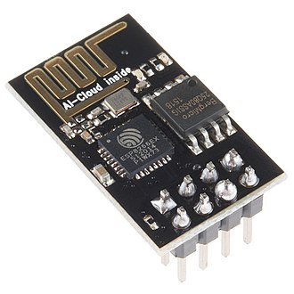
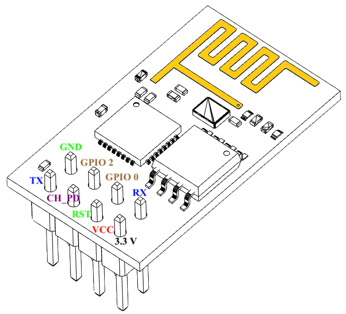
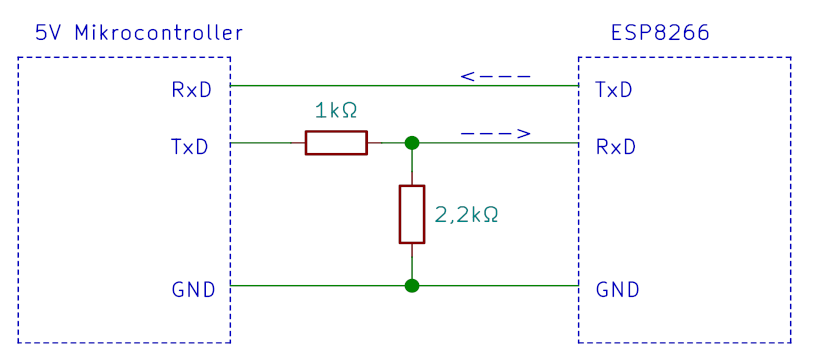
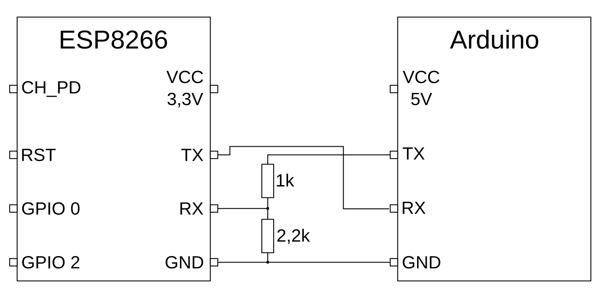

# ESP8266

Der ESP8266 ist ein 32-Bit Microcontroller der Firma espressif. Dieser hat ein WLAN-Modul eingebaut. Es ist möglich, den ESP8266 direkt über die Arduino-Umgebung zu programmieren. Diese Möglichkeit wird in unserem Aufbau jedoch nicht genutzt. Wir setzen hier einen herkömmlichen Arduino ein. Der ESP8266 dient nur als WLAN-Adapter für den Arduino.

## Modul und Anschluss

Der Chip ESP8266 ist mit weiteren Bauteilen (Speicher, Antenne, ...) auf einem Modul aufgelötet. Dieses Modul ist unter der Bezeichnung ESP-01 bekannt.  

| Foto | Pinbelegung |
| :----: | :-----------: |
|  Bildquelle: [Flickr.com / Sparkfun Electronics](https://c1.staticflickr.com/1/494/19681470919_9a9bcd5692_z.jpg) |  Bildquelle: [Wikipedia / Sayan123Wiki](https://commons.wikimedia.org/wiki/File:ESP8266_01_PinOut.png) |

Von den Schnittstellen des Chips sind acht nach außen geführt.
1. `RX`, Datenpin Empfang
1. `VCC`, Spannung (+3,3 V bis 3,6 V)
1. `GPIO 0`
1. `RST`, Reset (Reset wenn low)
1. `GPIO 2`
1. `CH_PD`, Chip power-down (Chip an wenn high)
1. `GND`, Masse (0 V)
1. `TX`, Datenpin Senden

In unserem Aufbau werden davon nur sechs Pins verwendet: Die beiden GPIO Pins bleiben ungenutzt.

Beim normalen Betrieb werden die Pins `VCC`, `RST` und `CH_PD` fest mit der Spannungsquelle verbunden. Der Pin `GND` wird fest mit Masse verbunden. Die beiden Pins `RX` und `TX` nutzen wir zur Kommunikation mit dem Arduino. 

## Serielle Schnittstelle zum Arduino

Zur Kommunikation zwischen ESP8266 und Arduino nutzen wir eine serielle Schnittstelle (UART, Universal Asynchronous Receiver Transmitter). 

### Anschluss 
Damit das eine Modul die Daten empfangen kann, die das andere Modul sendet, werden die `RX` und `TX` Pins "über Kreuz" verbunden. D.h. der Ausgang (`TX`) des Arduino wird mit dem Eingang (`RX`) des ESP8266 verbunden und umgekehrt.

### SoftwareSerial

Der Arduino UNO hat nur einen Hardare UART Baustein. Dieser wird bereits zur Kommunikation mit dem PC genutzt, z.B. um Debug-Meldungen auszugeben. Über die gleiche Schnittstelle kann der ESP8266 daher nicht angeschlossen werden.

Als Alternative gibt es die Arduino Library `SoftwareSerial`. Diese stellt eine zweite Serielle Schnittstelle bereit. Allerdigns wird sie duch Software-Funktionen realisiert. Daher bietet sie nur eingeschränkte Funktionen und Leistung. Weitere Informationen und ein Beispiel finden sich in der [Arduino Dokumentation SoftwareSerial](https://www.arduino.cc/en/Reference/softwareSerial).

### Spannungspegel
Es gilt dabei noch eine weitere Besonderheit zu beachten: Der ESP8266 arbeitet mit einer Betriebsspannung von 3,3V, der Arduino mit 5V. 

An seinem Eingang ist der Arduino relativ tolerant. Laut Datenblatt erkennt er Spannungspegel von mindestens 3V als `high`. Daher kann der Pin `TX` vom ESP8266 direkt mit dem Pin `RX` vom Arduino verbunden werden. 

Beim Senden von Daten liefert der Arduino jedoch eine Spannung von bis zu 5V. Diese Spannung ist zu hoch für den ESP8266. 

<!-- ##### dieser Abschnitt beantwortet die Aufgabe Anpassung Spannungspegel -->
<!-- Eine einfache Möglichkeit zur Anpassung ist  ein Spannungsteiler wie im Bild dargestellt. -->

<!-- 
Bildquelle: [stefanfrings.de](http://stefanfrings.de/esp8266/spannungsteiler.png) -->

<!--  -->
 
<!-- Durch diese Schaltung wird die Spannung, die am Pin `RX` des ESP8266 ankommt, auf ein vertretbares Level herabgesetzt. -->