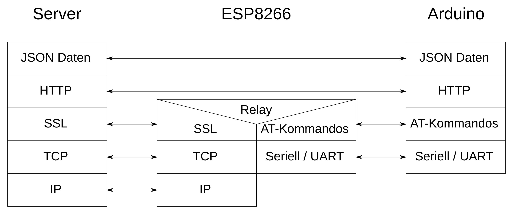

# Übersicht Dokumentation

* [Aufgabenstellung](./Aufgabenstellung.md)
* [ESP8266](./ESP8266.md)
* [AT Kommandos](./AT-Commands.md)
* [HTTP](./HTTP.md)
* [JSON](./JSON.md)
* [How to Debug](HowToDebug.md)

* Arduino "Progmem" --> siehe [arduino.cc](https://www.arduino.cc/reference/en/language/variables/utilities/progmem/)

* SoftSerial --> siehe [arduino.cc](https://www.arduino.cc/en/Reference/softwareSerial)

* Cloud-Umgebung
    * grober Aufbau?
    * Erwartete Daten
    * Authentifizierung
    
* Firmware-flashing ESP8266