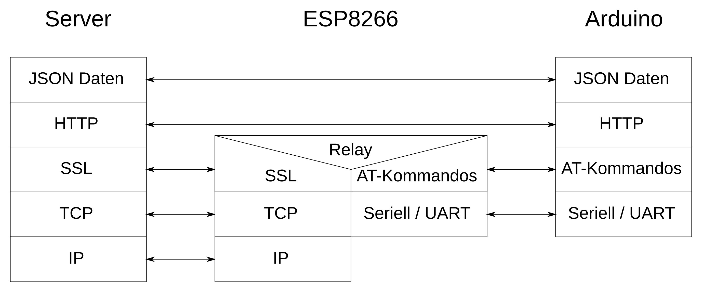

# Übersicht Dokumentation

* [Aufgabenstellungen](docs/Aufgabenstellungen.md)
* [ESP8266](docs/ESP8266.md)
* [SoftwareSerial](./SoftwareSerial.md)
* [AT Kommandos](docs/AT-Commands.md)
* [HTTP](docs/HTTP.md)
* [JSON](docs/JSON.md)
* [How to Debug](docs/HowToDebug.md)
* [Cloud-Umgebung](docs/Cloud.md)

* [Firmware-flashing ESP8266](docs/Firmware.md)

