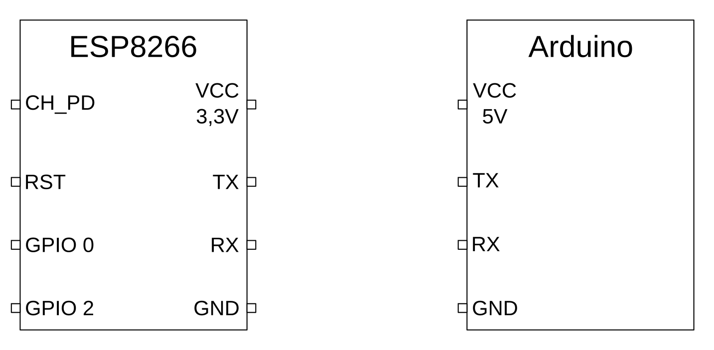

# Aufgabenstellungen

## Anpassung Spannungspegel

Weitere Informationen: [ESP8266](ESP8266.md)

* Der ESP8266 arbeitet mit 3,3V. Eingangs-Signale sollten keine höheren Pegel als 3,5V haben. Der Arduino arbeitet mit 5V. Ausgangspegel haben in der Regel entweder 0V oder 5V.
* Wie können die Spannungspegel durch eine möglichst einfache Schaltung angepasst werden?

## Zweite Serielle Schnittstelle am Arduino

* Der Arduino UNO hat (in der Hardware) nur eine serielle Schnittstelle. Diese wird bereits zur Kommunikation mit dem PC genutzt, z.B. um Debug-Meldungen auszugeben. Über die gleiche Schnittstelle kann der ESP8266 daher nicht angeschlossen werden.
* Schaut euch die Arduino Dokumentation zur Library [SoftwareSerial](https://www.arduino.cc/en/Reference/softwareSerial) an.
* An welche Pins am Arduino kann das WLAN-Modul angeschlossen werden?

## Hardware Aufbau

Weitere Informationen: [ESP8266](ESP8266.md)

* Plant den Hardware-Aufbau, erstellt eine Skizze. 
  * Achtet darauf, die Anpassung des Spannungspegels richtig umgesetzt zu haben.
  * Achtet darauf, die richtige Spannungsquelle (3,3V) zu verwenden.
* Verbindet das Modul wie geplant mit dem Arduino.

## Inbetriebnahme des WLAN Moduls

Weitere Informationen: [AT-Kommandos](AT-Commands.md)

* Der Arduino soll über die Serielle (Software-) Schnittstelle AT-Kommandos an den ESP8266 senden und Antworten empfangen. Gleichzeitig soll der Arduino über die Serielle (Hardware-) Schnittstelle Debug-Ausgaben an den PC senden.
* Schreibt eine `setup()` Routine, die die beiden Seriellen Schnittstellen konfiguriert. 
* Schreibt eine Methode `receive(long duration)`, die für die angegebene Zeit Daten vom ESP8266 empfängt. Jedes Zeichen soll vom Arduino an den PC weitergegeben werden.
* Sendet in eurer `loop()` Methode wiederholt ein einfaches AT-Kommando an den ESP8266 (mit dem erwarteten Zeilenwechsel, also z.B. `AT+GMR\r\n`). Ruft im Anschluss die vorher implementierte Empfangs-Methode auf, um die Daten entgegenzunehmen.
* Beachtet, dass der ESP8266 nach jedem Kommando ausreichend Zeit für die Verarbeitung braucht.
* Testet eure Implementierung. Funktioniert die Kommunikation mit dem WLAN-Modul?

## Konfiguration WLAN

Weitere Informationen: [AT-Kommandos](AT-Commands.md)

* Der ESP8266 kann so konfiguriert werden, das er sich mit einem WLAN Netz verbindet.
* Sendet die entsprechenden Konfigurations-Kommandos in euerer `setup()` Routine.
* Beachtet, dass der ESP8266 nach jedem Kommando ausreichend Zeit für die Verarbeitung braucht.
* Wie könnt ihr testen, dass die Verbindung aufgebaut wurde?

## Erste HTTP Verbindung

Weitere Informationen: [AT-Kommandos](AT-Commands.md), [HTTP](HTTP.md)

* Welche Kommandos sind notwendig, um eine Netzwerkverbindung zu öffnen und Daten zu senden?
* Schreibt ein einfaches Programm, das eine Webseite über HTTP abruft (z.B. `web.de`)
* Beachtet, dass ihr in der `setup()` Methode das Kommando `AT+CIPSSLSIZE=4096` ausführt, um einen ausreichend großen Puffer für die SSL Verschlüsselung im ESP8266 zu reservieren.
* Kontrolliert die korrekte Funktion, indem ihr die Antworten des ESP8266 über die Konsole des Arduinos anschaut.

## HTTP Verbindung zum Cloud-Server

Weitere Informationen: [HTTP](HTTP.md) und [JSON](JSON.md)

* Im nächsten Schritt sollen regelmäßig (z.B. alle 10s) Sensor-Informationen vom Arduino an den Server in der Cloud geschickt werden.
* Implementiert eine Upload-Funktion, die Daten über HTTP an den Server überträgt.
* Erstellt einen String, der ein einfaches JSON-Dokument mit den Sensordaten enthält, z.B. `{"value":123.45}`
* Übertragt regelmäßig die Sensor-Daten an den Server.
* Kontrolliert die Rückmeldung des ESP8266 über die Konsole des Arduinos.
* Prüft gemeinsam mit einem der Bosch Mitarbeiter, ob die Daten im Dashboard dargestellt werden.

## Rückmeldung am Arduino

* Wie kann man am Arduino sichtbar machen, dass die Datenübertragung ins Internet funktioniert?
