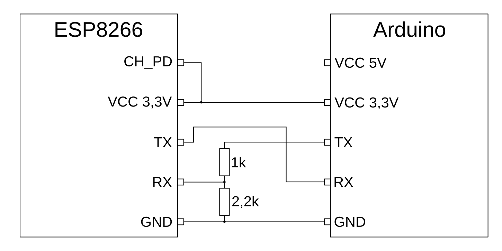
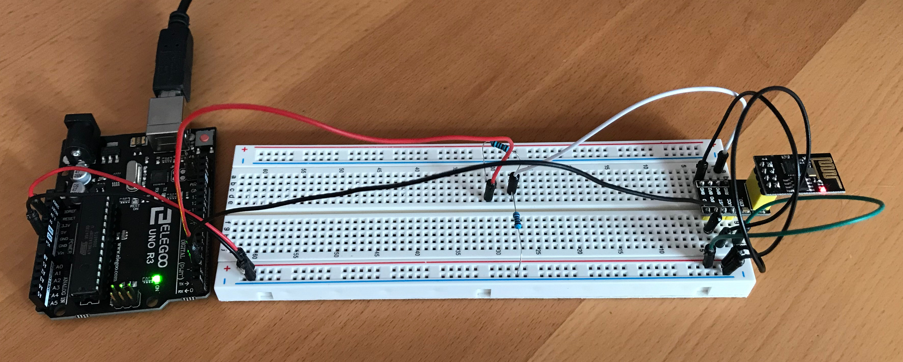

# Musterlösung

## 1) Zweite serielle Schnittstelle am Arduino

Beliebige Pins am Arduino, aber nicht Pins 0 und 1, diese sind bereits durch die serielle Hardware Schnittstelle belegt. Möglichst auch keine Pins, die bereits für LED, Sensor oder Display verwendet werden.

Wichtig: Die Schüler haben Pins festgelegt und verwenden diese durchgängig in den folgenden Aufgaben.

## 2) Hardware Aufbau

### Schaltplan

Die Pins `RX` und `TX` am Arduino sollten mit den Nummern aus Aufgabe 1) gekennzeichnet werden.



### Foto




## 3) Daten weiterleiten

Die Pins im Code müssen zu der Festlegung aus Aufgabe 1) passen.

```C++
#include <SoftwareSerial.h>

#define SOFTSERIAL_RX_PIN 2
#define SOFTSERIAL_TX_PIN 3

SoftwareSerial softSerial(SOFTSERIAL_RX_PIN, SOFTSERIAL_TX_PIN);

void receive(long duration) {
  long end = millis() + duration;
  while(millis() < end) {
    if(softSerial.available()) {
      char val = softSerial.read();
      Serial.write(val);
    }
  }
}

void setup() {
  // configure the hardware-serial
  Serial.begin(9600);
  // configure the soft-serial
  softSerial.begin(9600);
}

void loop() {
  // noch leer
}
```


## 4) Erste Kommandos an das WLAN Modul

Als Test-Kommando eignen sich z.B.
* `AT` --> leeres Kommando, sollte immer `OK` zurückgeben
* `AT+RST` --> Neustart des Moduls
* `AT+GMR` --> zeigt Versionsinformationen an
* `AT+CWMODE?` --> fragt den Geräte-Modus ab 
* `AT+CWLAP` --> zeigt eine Liste aller gefundenen WLAN Access Points an
* `AT+CWJAP_CUR?` --> zeigt an, zu welchem WLAN Netz das Modul verbunden ist
* `AT+CIFSR` --> zeigt die IP-Adresse und die MAC-Adresse des ESP8266 im WLAN an


Code wie oben, mit der Ergänzung:
```C++
...

void loop() {
  softSerial.print("AT+GMR\r\n");
  receive(5000);
}
```

In der Arduino-Software den seriellen Monitor öffnen (im Menü Werkzeuge). Es sollten die Ausgaben des WLAN-Moduls erscheinen. Bei "Zeichenmüll" kann ein Aus- und Einstecken des USB Kabels helfen.

## 5) Konfiguration WLAN

Kommando für die WLAN-Konfiguration: (eins von beiden, besser das mit `_DEF`)
* `AT+CWJAP_CUR="Netz","Passwort"` --> konfiguriert das Modul für eine Verbindung mit einem WLAN Netz "Netz" mit dem Passwort "Passwort".
* `AT+CWJAP_DEF="Netz","Passwort"` --> wie `AT+CWJAP_CUR`, aber die Konfiguration wird im Modul gespeichert.

Kommandos zum Testen:
* `AT+CWJAP_CUR?` --> zeigt an, zu welchem WLAN Netz das Modul verbunden ist
* `AT+CIFSR` --> zeigt die IP-Adresse und die MAC-Adresse des ESP8266 im WLAN an
* `AT+PING=<IP>` --> sendet ein "ping" Paket an die angegebene Adresse. Es werden auch Host-Namen unterstützt.

Code wie oben, mit diesen Ergänzungen:

```C++
void setup() {
  ...
  // configure the WiFi
  softSerial.print("AT+CWJAP_DEF=\"Netzwerk\",\"Passwort\"\r\n");
  receive(10000);
}

void loop() {
  // show IP information
  softSerial.print("AT+CIFSR\r\n");
  receive(1000);
}
```

Ausgabe der Konsole beobachten. Aufbau der WIFI-Verbindung wird i.d.R. auch ohne die Test-Kommandos anzgezeigt.

## 6) Erste HTTP Verbindung

Kommandos um Daten zu übertragen (aus der Dokumentation [AT-Kommandos](AT-Commands.md), ganz unten):
1. `AT+CIPSTART... `
1. warten, bis die Verbindung aufgebaut ist
1. `AT+CIPSEND=AnzahlBytes`
1. kurz warten, bis der ESP8266 bereit ist
1. Daten senden, genaue Datenmenge wie im Kommando angegeben
1. warten auf Daten vom Server
1. `AT+CIPCLOSE` 
1. warten, bis die Verbindung abgebaut ist

Text, der gesendet werden muss (aus der Dokumentation [HTTP](HTTP.md)):
```
GET / HTTP/1.1
Host: neverssl.com

```
Wichtig: 
* Zeilenwechsel durch `\r\n`
* Leerzeile am Ende nicht vergessen, also `\r\n\r\n`


Code wie oben, jedoch neue Methode `httpGet()` (oder ähnlich) und Methode `loop()` geändert implementiert:

```C++
const char http_header[] = ;

void httpGet() {
  softSerial.print("AT+CIPSTART=\"TCP\",\"neverssl.com\",80\r\n");
  receive(2000);
  softSerial.print("AT+CIPSEND=");
  softSerial.print(38); // Laenge der Header-Zeichenkette
  softSerial.print("\r\n");
  receive(2000);
  softSerial.print("GET / HTTP/1.1\r\nHost: neverssl.com\r\n\r\n");
  receive(10000);
  softSerial.print("AT+CIPCLOSE\r\n");
  receive(1000);
}

void loop() {
  httpGet();
  delay(20000);
}
```

Um händisches Zählen zu vermeiden kann der Header als Variable abgelegt werden. Die Länge kann über `strlen()` abgefragt werden.

```C++
const char http_header[] = "GET / HTTP/1.1\r\nHost: neverssl.com\r\n\r\n";

void httpGet() {
  ...
  softSerial.print("AT+CIPSEND=");
  softSerial.print(strlen(http_header));
  softSerial.print("\r\n");
  ...
}
```

Konsole beobachten. Es sollte eine HTML-Seite mit einer Bildschrimseite Inhalts-Text ausgegeben werden.

## 7) HTTP Verbindung zum Cloud-Server

Device-ID aus der Liste oder von uns angegeben. SharedAccessSignature muss passen.

Content-Length ist immer 18 Zeichen, durch die führenden Leerzeichen ist die Länge konstant: `{"value":00000123}`

```C++
void setup() {
  ...
  softSerial.print("AT+CIPSSLSIZE=4096\r\n");
  receive(2000);
}

const char http_header[] = "POST /devices/test-dev-id/messages/events?api-version=2020-03-13 HTTP/1.1\r\n"
      "Host: test-bosch-sfp-kos.azure-devices.net\r\n"
      "Content-Type: application/json\r\n"
      "Authorization: SharedAccessSignature sr=test-bosch-sfp-kos.azure-devices.net%2Fdevices%2Ftest-dev-id&sig=bc7aFCapDtR8ZSQxKjlH3vtXR23Eat3WK%2BLXoIRBuL0%3D&se=1633634949\r\n"
      "Content-Length: 18\r\n\r\n";
      
void upload(long sensorwert) {
  char buffer[32];
  sprintf(buffer, "{\"value\":% 8ld}", sensorwert); // 18 Zeichen

  softSerial.print("AT+CIPSTART=\"SSL\",\"test-bosch-sfp-kos.azure-devices.net\",443\r\n");
  receive(2000);
  softSerial.print("AT+CIPSEND=");
  softSerial.print(strlen(http_header)+18);
  softSerial.print("\r\n");
  receive(2000);
  softSerial.print(http_header);
  softSerial.print(buffer);
  receive(10000);
  softSerial.print("AT+CIPCLOSE\r\n");
  receive(1000);  
}

void loop() {
  upload(0); // should be a reasonable value, read from the sensor
  delay(20000);  
}

```
